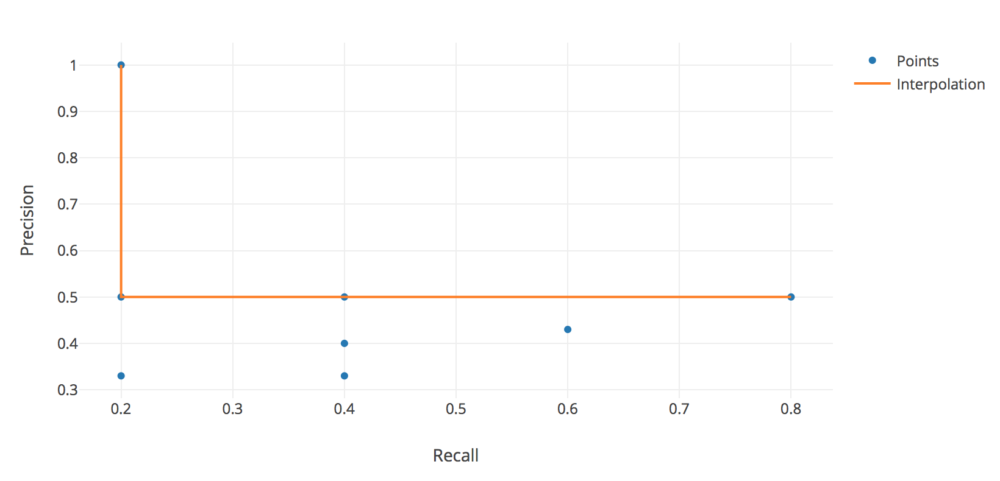

# Assignment 3
Authors:

1. Dhruv Mishra, st154709@stud.uni-stuttgart.de, Matriculation number: 3293775

2. Ishan Adhaulia, st159571@stud.uni-stuttgart.de, Matriculation number: 3319219

## Task1
We are using Google as the search engine. First 10 urls are for the query "how to pass exam" and the next 10 are for "why do we celebrate christmas"

R means relevant and NR means not-relevant.

|num|URL|Dhruv|Ishan|
|---|---|---|---|
|1|https://www.wikihow.com/Pass-Final-Exams|R|NR|
|2|http://www.mirror.co.uk/lifestyle/how-to-revise-no-time-4927208|R|NR|
|3|https://smart.study/blog/13-tips-on-how-to-pass-any-exam-in-a-week/|R|NR|
|4|https://theuniversityblog.co.uk/2010/04/23/pass-exams-effectively/|R|NR|
|5|http://www.explainthatstuff.com/howtopassexams.html|R|NR|
|6|https://wisdomfrombooks.wordpress.com/how-to-pass-exams-7-useful-tips/|R|NR|
|7|https://owlcation.com/academia/How-to-Pass-Exams-Revision-Techniques-to-Help-You-Succeed|R|NR|
|8|https://www.youtube.com/watch?v=I27krR-z9gI|R|NR|
|9|https://www.youtube.com/watch?v=4HSRrPk3B5o|NR|NR|
|10|https://www.topuniversities.com/student-info/health-and-support/exam-preparation-ten-study-tips|R|NR|
|11|https://study.com/academy/popular/how-to-pass-the-police-exam.html|NR|NR|
|12|https://study.com/academy/popular/how-to-pass-a-reading-comprehension-test.html|NR|NR|
|13|https://study.com/academy/popular/how-to-pass-the-psi-real-estate-exam.html|NR|NR|
|14|https://study.com/academy/popular/how-to-pass-a-physics-test.html|NR|NR|
|15|https://study.com/academy/popular/how-to-pass-a-science-test.html|NR|NR|
|16|https://www.hotcoursesabroad.com/india/test-preparation/how-to-prepare-for-toefl-exam/how-to-pass-the-toefl-exam/|NR|NR|
|17|https://www.simplilearn.com/clearing-ccna-certification-top-study-tips-for-exam-rar272-article|NR|NR|
|18|https://www.simplilearn.com/10-cisa-exam-tips-article|NR|NR|
|19|http://www.davidlprowse.com/pass-any-certification-exam.php|R|NR|
|20|https://www.schweser.com/cfa/blog/how-to-pass-the-cfa-exam|NR|NR|
|21|https://www.gotquestions.org/why-celebrate-Christmas.html|R|NR|
|22|https://www.whychristmas.com/customs/25th.shtml|R|NR|
|23|https://www.gty.org/library/questions/QA68/why-do-we-celebrate-christmas-on-december-25|R|NR|
|24|https://answersingenesis.org/answers/biblical-authority-devotional/why-do-we-celebrate-christmas/|R|NR|
|25|https://www.catholicireland.net/25-what-do-we-celebrate-on-christmas-day-and-why/|R|NR|
|26|https://en.wikipedia.org/wiki/Christmas|R|NR|
|27|https://www.youtube.com/watch?v=4YBJNXNlREQ|R|NR|
|28|http://www.christianitytoday.com/news/2008/december/151-55.0.html|R|NR|
|29|http://www.christianitytoday.com/history/2008/august/why-december-25.html|NR|NR|
|30|https://unternehmen.kaethe-wohlfahrt.com/en/allgemein-en/why-do-we-actually-celebrate-christmas|R|NR|
|31|https://www.washingtonpost.com/news/answer-sheet/wp/2015/12/25/why-is-christmas-on-dec-25-a-brief-history-lesson-that-may-surprise-you/?utm_term=.e2f81ab1f0a9|NR|NR|
|32|http://www.history.com/news/ask-history/why-is-christmas-celebrated-on-december-25|NR|NR|
|33|https://www.ucg.org/the-good-news/the-top-10-reasons-why-i-dont-celebrate-christmas|NR|NR|
|34|http://www.huffingtonpost.com.au/thomas-kuzma/why-do-we-celebrate-christmas_a_21632922/|R|NR|
|35|https://theculturetrip.com/europe/united-kingdom/england/london/articles/why-do-we-celebrate-christmas/|R|NR|
|36|https://www.thoughtco.com/why-is-christmas-on-december-25-700439|R|NR|
|37|https://www.elephantjournal.com/2017/12/why-do-we-celebrate-christmas-anyway/|R|NR|
|38|https://familychristmasonline.com/musings/celebrating/celebrating.htm|R|NR|
|39|http://theconversation.com/how-did-we-come-to-celebrate-christmas-66042|R|NR|
|40|http://www.slate.com/articles/life/holidays/2012/12/why_is_christmas_in_december.html|NR|NR|

## Task2
Given the documents:
- d1: Xerox reports a profit but revenue is down
- d2: Lucene narrows quarter loss but revenue decreases further

Given the query:
- q: revenue down

Lambda = 0.3

P(q|d1) = (Lambda*(1/8) + (1-Lambda)*(2/16)) * (Lambda*(1/8) + (1-Lambda)*(1/16)) = 0.01

P(q|d2) = (Lambda*(1/8) + (1-Lambda)*(2/16)) * (Lambda*(0/8) + (1-Lambda)*(1/16)) = 0.005

Therefore d1 is more likely.

Since the only difference between the two probabilities is the term Lambda*(1/8) (from P(q|d1)), the ranking will be similar for small values like 0.1 and will be greatly dissimilar for high values like 0.7, with d1 being greater than d2.

The reason is that high values enable conjuctive like search and since d1 has both the terms from the query, it's ranking increases greatly.

## Task3
Correct result: 1,33,40,63,126

Predicted result: 126,8,9,1,34,31,40,63

|k|Result Set|P|R|
|---|---|---|---|
|1|126|1|0.2|
|2|126,8|0.5|0.2|
|3|126,8,9|0.33|0.2|
|4|126,8,9,1|0.5|0.4|
|5|126,8,9,1,34|0.4|0.4|
|6|126,8,9,1,34,31|0.33|0.4|
|7|126,8,9,1,34,31,40|0.43|0.6|
|8|126,8,9,1,34,31,40,63|0.5|0.8|

##### Interpolated precision recall graph

## Task4
##### Motivation for probabilistic ranking
The task of IR is to return documents which provide the required information. For example, If I want to get the directions from Stuttgart to Munich, the query [Stuttgart Munich train] made to a Vector model will return all documents which provide train routes because the documents will be similar with the query.

However, there may be an air or bus route which may also be available and the vector model will completely miss it. Therefore, we need a probabilistic measure of how relevant a document is to a give query.

## Task5
(It is being assumed that terms from the stop words list will be ignored/dropped from the query and/or document)
##### Advantages
- A high tf-idf score means that the the given term occurs very rarely in very documents. This is a very good indicator of similarity and implies that the corresponding documents will be highly relevant to the given query.
- More accurate than stop words because of a measurable metric of relevance.

##### Disadvantages
- High computation/time cost. Simply dropping the terms from the stop words list decreases the search space and is therefore faster.
- No clear indicator of relevance is available when the tf-idf scores are low.